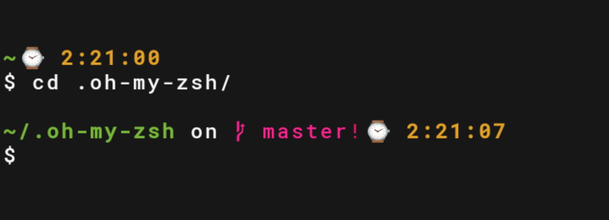

# AMUZE
Amuse theme without clock

## Installation
1. Install the following:
* [oh-my-zsh](https://github.com/robbyrussell/oh-my-zsh)
2. Install this theme
```
cd 
git clone https://github.com/konzet/amuze/
```
3. Move `amuze-zsh.theme` to directory `oh-my-zsh/themes`
```
mv ~/amuze/amuze.zsh-theme ~/.oh-my-zsh/themes
```
4. To use, add `amuze` to the list of theme in your `.zshrc` file:

```
ZSH_THEME=(amuze)
```
5. Reload your terminal
### screenshoots    
With clock 

Without clock

